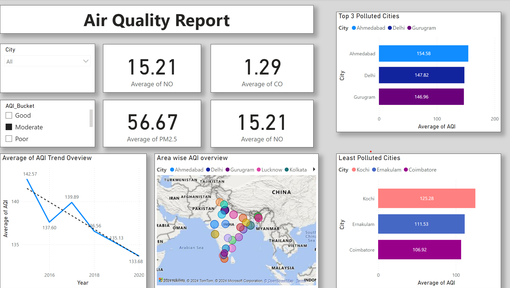

# Power BI Dashboard for Air Quality Report

## Overview

This Power BI dashboard provides a comprehensive overview of air quality across different cities using various pollutant data. It helps users analyze air quality trends, identify pollution hotspots, and make data-driven decisions to improve air quality management.

## Data Description

The dashboard is built using the following columns:

- **City**: Name of the city where the air quality data is collected.
- **Date**: Date of data collection.
- **PM2.5**: Particulate Matter with a diameter of 2.5 micrometers or less (µg/m³).
- **PM10**: Particulate Matter with a diameter of 10 micrometers or less (µg/m³).
- **NO**: Nitric Oxide concentration (µg/m³).
- **NO2**: Nitrogen Dioxide concentration (µg/m³).
- **NOx**: Nitrogen Oxides concentration (NO + NO2) (µg/m³).
- **NH3**: Ammonia concentration (µg/m³).
- **CO**: Carbon Monoxide concentration (mg/m³).
- **SO2**: Sulfur Dioxide concentration (µg/m³).
- **O3**: Ozone concentration (µg/m³).
- **Benzene**: Benzene concentration (µg/m³).
- **Toluene**: Toluene concentration (µg/m³).
- **Xylene**: Xylene concentration (µg/m³).
- **AQI**: Air Quality Index, representing the overall level of air pollution.
- **AQI_Bucket**: Category of air quality based on the AQI value (e.g., Good, Satisfactory, Moderate, Poor, Very Poor, Severe).

## Dashboard Features

- **Interactive Visualization**: Explore and filter data by city, date, and pollutants.
- **Trend Analysis**: View historical trends for individual pollutants and the overall Air Quality Index (AQI).
- **Geographical Insights**: Analyze air quality at a city level to identify regions with high pollution levels.
- **Comparative Analysis**: Compare multiple cities or time periods to identify patterns and changes in air quality.

## Usage

1. **Filtering**: Use the slicers to filter data by city, date, or specific pollutants.
2. **Drill-Down**: Click on visual elements to drill down for more detailed insights.
3. **Tooltips**: Hover over visual elements to view additional data points and metadata.

## Data Source

The air quality data is collected from authorized environmental monitoring agencies.

### Screenshot

## Getting Started

To use the dashboard:

1. Download or clone this repository.
2. Open the Power BI file (`.pbix`) in Power BI Desktop.
3. Interact with the visuals to explore different aspects of the air quality data.
4. Customize the visuals as needed.

## Thank You For Visiting

